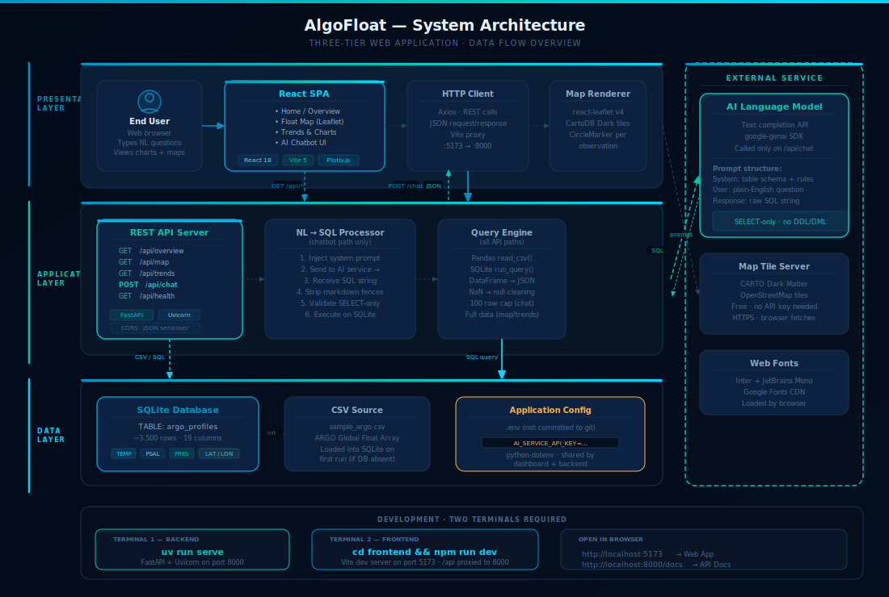

# AlgoFloat — Ocean Intelligence Platform

AI-powered ARGO ocean float data explorer. Query, visualise, and chat with real oceanographic observations from the global [ARGO float array](https://argo.ucsd.edu/) using natural language and Gemini 2.0 Flash.

---

## Architecture

<p align="center">
  
</p>

The platform is split into two processes that communicate over a local REST API:

| Layer | Technology | Port |
|---|---|---|
| Frontend | React 18 + Vite 5 | 5173 |
| Backend | FastAPI + Uvicorn | 8000 |
| Database | SQLite (loaded from CSV) | — |
| AI | Google Gemini 2.0 Flash | cloud |

---

## Project Structure

```
AlgoFloat-main/
├── backend/
│   └── main.py              # FastAPI app — all /api/* endpoints
│
├── frontend/
│   ├── package.json         # npm dependencies
│   ├── vite.config.js       # Vite config + /api proxy to :8000
│   ├── index.html
│   └── src/
│       ├── main.jsx         # React entry point
│       ├── App.jsx          # BrowserRouter + layout
│       ├── index.css        # Design tokens + global styles
│       ├── api.js           # Axios API client
│       ├── plotlyTheme.js   # Shared Plotly dark-ocean config
│       ├── components/
│       │   ├── Sidebar.jsx / Sidebar.css
│       │   ├── PageHeader.jsx
│       │   ├── MetricCard.jsx
│       │   ├── SectionHeader.jsx
│       │   └── Spinner.jsx
│       └── pages/
│           ├── Home.jsx     # Landing page with hero + feature cards
│           ├── Overview.jsx # KPIs, distributions, correlation matrix
│           ├── MapPage.jsx  # Plotly scattermapbox (dark ocean)
│           ├── Trends.jsx   # Time series, depth profile, T-S diagram
│           └── Chatbot.jsx  # NL → SQL → result + auto chart
│
├── dashboard/               # Original Streamlit app (kept for reference)
│   ├── app.py
│   ├── db.py                # SQLite helpers (reused by FastAPI backend)
│   ├── chatbot/
│   │   ├── gemini_client.py # Gemini SDK wrapper (reused by FastAPI)
│   │   └── prompt.py        # System prompt for SQL generation
│   └── pages/
│
├── data/
│   ├── sample_argo.csv      # ARGO float observations
│   └── argo.db              # SQLite DB (auto-created from CSV)
│
├── algofloat/
│   └── cli.py               # uv run scripts: start / dev / serve
│
├── docs/
│   └── architecture.svg     # System architecture diagram
│
├── pyproject.toml           # Python project + uv scripts
└── .env                     # GEMINI_API_KEY (not committed)
```

---

## Quick Start

### Prerequisites
- [uv](https://github.com/astral-sh/uv) (Python package manager)
- [Node.js](https://nodejs.org/) 18+ with npm

### 1. Set your Gemini API key

```
GEMINI_API_KEY=your_key_here
```

Store this in `dashboard/.env` (already used by the backend).

### 2. Start the FastAPI backend

```bash
uv run serve
```

This launches the API server on **http://localhost:8000** with hot-reload.

Available endpoints:

| Method | Path | Description |
|---|---|---|
| GET | `/api/overview` | KPIs, distributions, stats, correlation |
| GET | `/api/map` | All float lat/lon + parameters |
| GET | `/api/trends` | Time-sorted observations |
| POST | `/api/chat` | `{ "prompt": "..." }` → SQL + results |
| GET | `/api/health` | Health check |

### 3. Start the React frontend

```bash
cd frontend
npm run dev
```

Opens at **http://localhost:5173**. All `/api` requests are proxied to `:8000` automatically.

---

## Pages

| Page | Route | Description |
|---|---|---|
| Home | `/` | Animated hero, feature cards, tech stack |
| Overview | `/overview` | 4 KPI metrics, dataset snapshot, histograms, correlation heatmap, per-float bar chart |
| Map | `/map` | Interactive global Plotly map, dark ocean basemap, parameter colour overlay, lat/lon histograms |
| Trends | `/trends` | Time series per float, depth profile, box plots, T-S diagram, rolling mean |
| Chatbot | `/chatbot` | NL query → Gemini SQL → SQLite → table + download + auto chart |

---

## Design System

All colours are defined as CSS custom properties in `frontend/src/index.css`:

| Token | Value | Use |
|---|---|---|
| `--bg` | `#020B18` | Page background |
| `--surface` | `#0A1628` | Card background |
| `--surf2` | `#0D2240` | Secondary surface |
| `--a1` | `#0094C6` | Ocean blue accent |
| `--a2` | `#00C6B8` | Teal accent |
| `--a3` | `#00D4FF` | Cyan accent |
| `--tx` | `#E8F4FD` | Primary text |
| `--tx2` | `#8FACC8` | Secondary text |
| `--ok` | `#00C896` | Success green |

Charts use the shared `oceanLayout()` function from `plotlyTheme.js` which applies the dark ocean Plotly theme consistently across all pages.

---

## Legacy Streamlit Dashboard

The original Streamlit dashboard is preserved in `dashboard/`. To run it:

```bash
uv run start       # normal mode
uv run dev         # with auto-reload
```

The FastAPI backend reuses `dashboard/db.py` and `dashboard/chatbot/` directly.

---

## Data Source

ARGO profiling floats are autonomous underwater vehicles deployed worldwide to measure ocean temperature, salinity, and pressure. Data: [Argo Program — UCSD](https://argo.ucsd.edu/).

```
Columns: N_POINTS · CYCLE_NUMBER · DATA_MODE · DIRECTION ·
         PLATFORM_NUMBER · PRES · PSAL · TEMP ·
         LATITUDE · LONGITUDE · TIME
```
